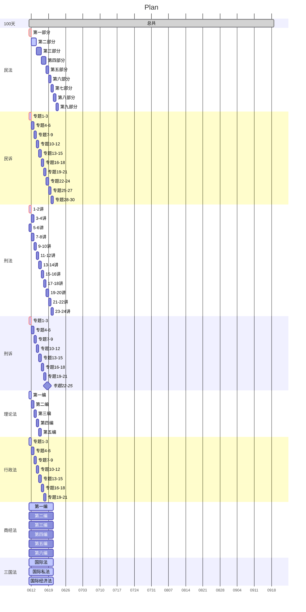
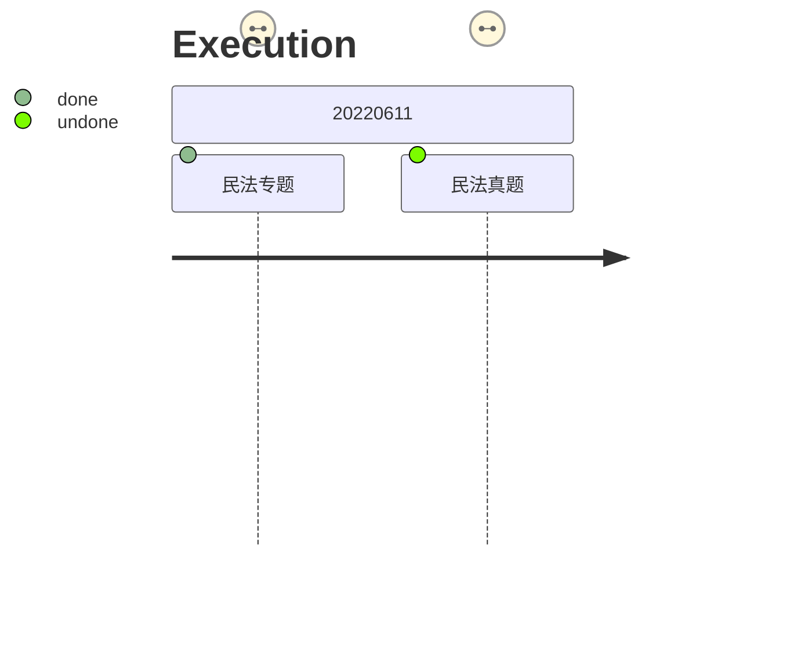

# **100天法考客观题通关尝试记实**
6.11-6.30 看书

```mermaid
gantt
  title Plan
  dateFormat YYYY-MM-DD
  axisFormat %m%d
  section 100天
    总共        :done ,2022-06-11,100d
  section 民法
    第一部分    :crit,done  , mf1, 2022-06-11,1d 
    第二部分    :active, mf2, 2022-06-12,2d
    第三部分    :        mf3, after mf2,2d
    第四部分    :        mf4, after mf3,2d
    第五部分    :        mf5, after mf4,1d
    第六部分    :        mf6, after mf5,1d
    第七部分    :        mf7, after mf6,1d
    第八部分    :        mf8, after mf7,1d
    第九部分    :        mf9, after mf8,1d
  section 民诉
    专题1-3    :crit,active, ms1, 2022-06-11,1d
    专题4-6    :        ms2, after ms1,1d
    专题7-9    :        ms3, after ms2,1d
    专题10-12  :        ms4, after ms3,1d
    专题13-15  :        ms5, after ms4,1d
    专题16-18  :        ms6, after ms5,1d
    专题19-21  :        ms7, after ms6,1d
    专题22-24  :        ms8, after ms7,1d
    专题25-27  :        ms9, after ms8,1d
    专题28-30  :        ms10, after ms9,1d
  section 刑法   
    1-2讲    :crit,active, xf1, 2022-06-11,1d
    3-4讲    :        xf2, after xf1,1d
    5-6讲    :        xf3, 2022-06-11,1d
    7-8讲    :        xf4, after xf3,1d
    9-10讲   :        xf5, after xf4,1d
    11-12讲  :        xf6, after xf5,1d
    13-14讲  :        xf7, after xf6,1d
    15-16讲  :        xf8, after xf7,1d
    17-18讲  :        xf9, after xf8,1d
    19-20讲  :        xf10, after xf9,1d
    21-22讲  :        xf11, after xf10,1d
    23-24讲  :        xf12, after xf11,1d
  section 刑诉
    专题1-3    :crit,active, xs1, 2022-06-11,1d
    专题4-6    :        xs2, after xs1,1d
    专题7-9    :        xs3, after xs2,1d
    专题10-12  :        xs4, after xs3,1d
    专题13-15  :        xs5, after xs4,1d
    专题16-18  :        xs6, after xs5,1d
    专题19-21  :        xs7, after xs6,1d
    专题22-25  :milestone,        xs8, after xs7,1d
  section 理论法
     第一编  :active, ll1, 2022-06-11,1d
     第二编  :        ll2, after ll1,1d
     第三编  :        ll3, after ll2,1d
     第四编  :        ll4, after ll3,1d
     第五编  :        ll5, after ll4,1d
  section 行政法
    专题1-3    :active, xz1, 2022-06-11,1d
    专题4-6    :        xz2, after xz1,1d
    专题7-9    :        xz3, after xz2,1d
    专题10-12  :        xz4, after xz3,1d
    专题13-15  :        xz5, after xz4,1d
    专题16-18  :        xz6, after xz5,1d
    专题19-21  :        xz7, after xz6,1d
  section 商经法
     第一编  :active, sj1, 2022-06-11,10d
     第二编  :        sj2, 2022-06-11,10d
     第三编  :        sj3, 2022-06-11,10d
     第四编  :        sj4, 2022-06-11,10d
     第五编  :        sj5, 2022-06-11,10d
     第六编  :        sj6, 2022-06-11,10d
  section 三国法
     国际法    :active, sg1, 2022-06-11,10d
     国际私法  :active, sg2, 2022-06-11,10d
     国际经济法:active, sg3, 2022-06-11,10d
```

# 20220611

```mermaid
journey
  title Execution
  section 20220611
    民法专题    : 94/94:done
    民法真题    : 40/61:undone
```
# 20220612 无学习

